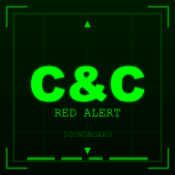

# C&C Red Alert Soundboard

A Progressive Web App (PWA) soundboard featuring 190 classic Command & Conquer Red Alert sound effects with an authentic Red Alert 1 themed UI.



## Live Demo

**[https://ravidorr.github.io/cnc-red-alert-soundboard/](https://ravidorr.github.io/cnc-red-alert-soundboard/)**

## Features

### Core Features
- **190 Sound Effects** - Unit voices, combat sounds, building effects, and more
- **Red Alert 1 Theme** - Green terminal aesthetic with military HUD styling
- **12 Categories** - Allied Forces, Soviet Forces, Tanya, Special Units, Civilians, Combat, Vehicles, Buildings & Defenses, Attack Dogs, Casualties, UI & Map, Miscellaneous
- **Favorites System** - Mark sounds as favorites for quick access with drag-and-drop reordering
- **Recently Played** - Quick access to your last 10 played sounds
- **Popular Sounds** - Curated collection of iconic sounds
- **Search** - Find sounds quickly by name with empty state feedback
- **Random Sound** - Play a random sound with one click

### PWA & Mobile
- **PWA Support** - Install as an app, works offline
- **Install Button** - One-click installation from the header
- **Responsive Design** - Works on desktop and mobile
- **Mobile Navigation** - Hamburger menu with slide-out category drawer

### Sharing & Links
- **Share Sounds** - Copy direct links to specific sounds
- **URL Hash Support** - Share URLs that auto-play sounds (e.g., `#sound=tanya_yeah.wav`)

### Accessibility (WCAG 2.1 AA)
- **Keyboard Navigation** - Full keyboard support with visible focus indicators
- **Screen Reader Support** - ARIA landmarks, labels, and live regions
- **Skip Link** - Jump directly to main content
- **Reduced Motion** - Respects `prefers-reduced-motion` preference
- **Color Contrast** - Meets WCAG AA contrast requirements

### User Feedback
- **Toast Notifications** - Visual feedback for actions (favorites, errors, sharing)
- **Now Playing Indicator** - Shows currently playing sound

## Local Development

Open `index.html` in a browser or serve with any HTTP server:

```bash
# Using Python
python3 -m http.server 8080

# Using Node.js
npx serve

# Using PHP
php -S localhost:8080
```

Then visit `http://localhost:8080`

## Installation as PWA

1. Open the soundboard in Chrome, Edge, or Safari
2. Click the install prompt that appears, or:
   - **Chrome/Edge**: Click the install icon in the address bar
   - **Safari**: File > Add to Dock
   - **Mobile**: Add to Home Screen from the share menu

## Project Structure

```
cnc-red-alert-soundboard/
├── index.html          # Main HTML file
├── manifest.json       # PWA manifest
├── service-worker.js   # Offline caching
├── css/
│   └── styles.css      # Red Alert 1 themed styles
├── js/
│   └── app.js          # Application logic (1500+ lines)
├── tests/
│   ├── app.test.js     # Unit tests (168 tests)
│   └── setup.js        # Jest setup with JSDOM
├── scripts/
│   └── rename_sounds.js # Sound file normalization utility
├── assets/
│   └── icons/          # PWA icons (72-512px)
└── sounds/             # 190 WAV sound files
```

## Development

### Prerequisites

- Node.js 22+ (see `.nvmrc`)

### Setup

```bash
npm install
```

### Scripts

| Command | Description |
|---------|-------------|
| `npm test` | Run tests |
| `npm run test:watch` | Run tests in watch mode |
| `npm run test:coverage` | Run tests with coverage report |
| `npm run lint` | Run all linters |
| `npm run lint:js` | Run ESLint |
| `npm run lint:css` | Run Stylelint |
| `npm run lint:html` | Run HTMLHint |
| `npm run lint:fix` | Auto-fix linting issues |

### Code Quality

- **ESLint** - JavaScript linting
- **Stylelint** - CSS linting
- **HTMLHint** - HTML validation
- **Jest** - Unit testing with jsdom
- **Husky** - Pre-commit hooks

### Pre-commit Hooks

The following checks run automatically before each commit:

1. JavaScript linting (no errors/warnings)
2. CSS linting (no errors/warnings)
3. HTML linting (no errors)
4. Test coverage (90% minimum)

### Test Coverage

Current coverage: **93%+** (168 tests)

Coverage thresholds enforced by pre-commit hooks:
- Statements: 90%
- Branches: 80%
- Functions: 90%
- Lines: 90%

## Sound Categories

| Category | Count | Description |
|----------|-------|-------------|
| Allied Forces | 31 | Allied unit voice responses |
| Soviet Forces | 26 | Soviet unit voice responses |
| Tanya | 15 | Tanya's iconic voice lines |
| Special Units | 20 | Engineer, Medic, Spy, Thief, Einstein |
| Civilians | 4 | Civilian voice lines |
| Combat | 18 | Weapons and explosions |
| Vehicles | 7 | Tanks, ships, aircraft |
| Buildings & Defenses | 17 | Construction and turrets |
| Attack Dogs | 6 | Dog sounds |
| Casualties | 10 | Death sounds |
| UI & Map | 16 | Interface and map sounds |
| Miscellaneous | 14 | Tesla, chronosphere, effects |

## Keyboard Shortcuts

| Key | Action |
|-----|--------|
| `Tab` | Navigate between interactive elements |
| `Enter` / `Space` | Activate buttons, toggle categories |
| `Escape` | Stop all sounds, close mobile menu |
| `Ctrl/Cmd + F` | Focus search input |

### Skip Link

Press `Tab` on page load to reveal the "Skip to content" link, then `Enter` to bypass the navigation.

## Browser Support

- Chrome/Chromium (recommended)
- Firefox
- Safari
- Edge

## Technology Stack

- **Vanilla JavaScript** - No frameworks, pure ES6+
- **CSS3** - Custom properties, Grid, Flexbox, animations
- **HTML5** - Semantic markup with ARIA attributes
- **Service Worker** - Offline caching with cache-first strategy
- **Web Audio API** - Sound playback
- **LocalStorage** - Favorites and recently played persistence

## Credits

Sound effects are from Command & Conquer: Red Alert by Westwood Studios (1996).

This is a fan project for personal/educational use only. Command & Conquer and Red Alert are trademarks of Electronic Arts Inc.

## License

MIT License - See [LICENSE](LICENSE) file for details.

The sound files are property of Electronic Arts Inc. and are included for personal/educational use only.
